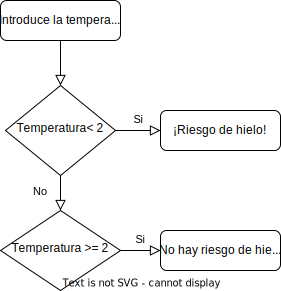
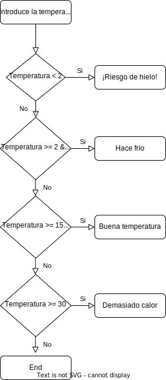

# Técnicas de programación - Tema 3
## Alejandro de Leon Fernández
## Pedro Manuel López Gutiérrez

El código de los ejercicios se encuentra en el directorio tema3/ y el main es tema3/SelectorEjercicios.java

El código ha sido realizado con intelliJ de forma colaborativa

### UML Ejercicio 5

### FLOWCHARTS
#### Ejercicio 1

#### Ejercicio 2

